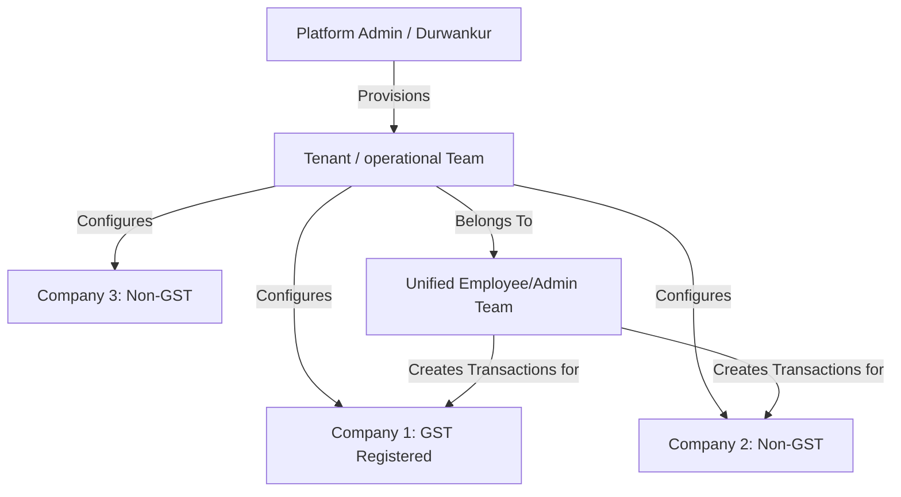
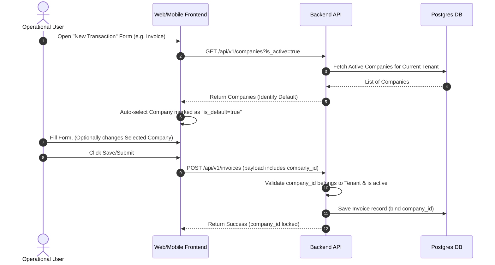
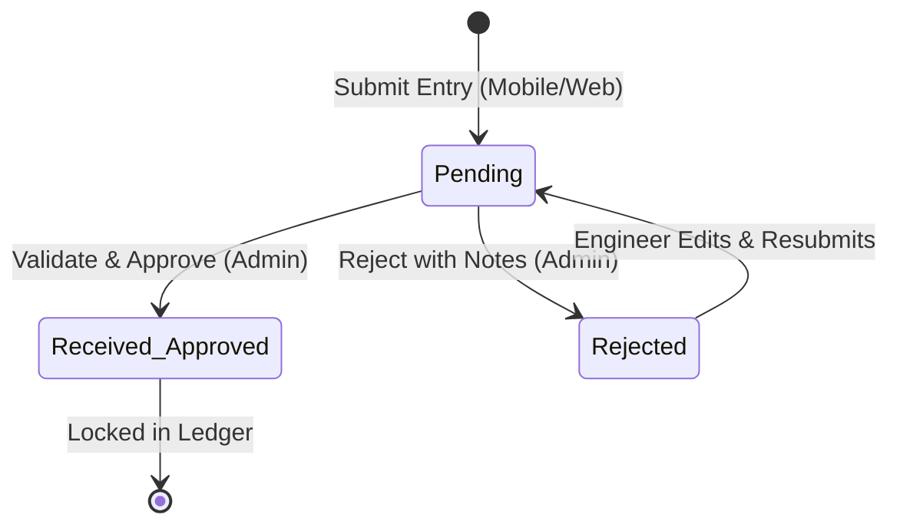

# Software Requirement Specification (SRS) & Functional Design Document
## Multi-Company, Cash Collection, & Template Management System

**Document Version:** 1.0.0  
**Date:** 2026-06-26  
**Status:** Approved / Shared with Development Team  
**Target Platform:** FastAPI (Backend) | React & Ant Design (Web Frontend) | React Native (Mobile App)

---

## 1. Executive Summary & Context

To support business scaling where a single operational team manages multiple distinct business entities (companies), the CCTV Management Application is being upgraded to support **Multi-Company Operations**. 

A single tenant (operational team/business owner) can configure and operate multiple companies (e.g., GST-registered vs. non-GST entities) under one dashboard. Employees and technicians will operate across all companies under role-based permissions, while records, billing branding, statutory details, document printing, and cash collection flows will run company-wise.

Additionally, this update introduces a **Mobile Cash Collection & Reconciliation** flow for field technicians and a comprehensive **Company-wise Document Template Management** engine.

---

## 2. System Architecture & Tenant Scope

The multi-company architecture is a logical hierarchy layered underneath the existing multi-tenant structure:



### Key Architectural Rules
1. **Tenant Isolation**: All companies, templates, and cash records must inherit `TenantMixin` and be strictly bound to a `tenant_id`. They are subject to PostgreSQL Row-Level Security (RLS).
2. **Unified Users & RBAC**: Users do **not** select a company at login. They log into their tenant subdomain. Users have a single Tenant Role (e.g., `admin`, `manager`, `technician`) that applies globally across all companies.
3. **Transaction Binding**: Every transactional record (Lead, Quotation, Invoice, AMC, Ticket, Purchase, Expense, Cash Collection) must reference a specific `company_id`. Once saved, the binding is **immutable** to prevent historical accounting discrepancies.

---

## 3. Detailed Functional Modules

### 3.1. Company Master Management (CRUD)
Administrators can configure and manage the list of operating companies.

*   **Attributes per Company**:
    *   `id` (UUID, Primary Key)
    *   `tenant_id` (UUID, Foreign Key)
    *   `name` (String, 255)
    *   `gst_status` (Enum: `GST_REGISTERED`, `NON_GST`)
    *   `gstin` (String, 20, Optional, required if `gst_status` is `GST_REGISTERED`)
    *   `address` (Text, Multi-line registration address)
    *   `contact_details` (JSON object storing phone numbers, contact emails, website)
    *   `bank_details` (JSON object or sub-structure: Bank Name, Beneficiary Name, Account Number, IFSC Code, Branch)
    *   `logo_url` (String, image asset URL)
    *   `authorized_signatory` (JSON object: Name, Designation, and Signature Image URL)
    *   `is_default` (Boolean. Only **one** company per tenant can be marked `true`. Setting this to `true` must automatically toggle `is_default` of other companies under the same tenant to `false`).
    *   `is_active` (Boolean, default `true`)

---

### 3.2. Cross-Application Company Selection Flow
Every transaction creation form must prompt the user to associate the transaction with an operating company.



#### Behavior Requirements
*   **Default State**: The dropdown auto-populates with the tenant’s configured Default Company.
*   **Mutability**: The selector is active only in "Create" mode. During editing or viewing, the dropdown is disabled (read-only).
*   **Mandatory Binding**: Schema-level validation requires a valid `company_id` for all transactions.

---

### 3.3. Company-wise Document Template Engine
Every printout or exported PDF must render with the chosen company's branding, layout, headers, bank accounts, and footers.

*   **Template Config Table (`company_templates`)**:
    *   `id` (UUID, Primary Key)
    *   `tenant_id` (UUID, Foreign Key)
    *   `company_id` (UUID, Foreign Key)
    *   `document_type` (Enum: `QUOTATION`, `TAX_INVOICE`, `NON_GST_INVOICE`, `DELIVERY_CHALLAN`, `AMC_REPORT`, `PAYMENT_RECEIPT`)
    *   `template_html` (Text/Jinja2 markup, stores custom HTML/CSS template overrides)
    *   `header_html` (Text/Jinja2 markup, custom header layout)
    *   `footer_html` (Text/Jinja2 markup, custom footer layout)
    *   `is_active` (Boolean, default `true`)
*   **Resolution Engine**:
    *   When generating a PDF (via WeasyPrint), the service retrieves the template matching the transaction's `company_id` and `document_type`.
    *   If no custom template is uploaded for that company, fallback to the **Global Tenant Template** for that document type.
    *   **Dynamic Placeholders (Merge Fields)**:
        *   `{{ company.name }}`, `{{ company.gstin }}`, `{{ company.bank_details.account_no }}`, `{{ company.logo_url }}`, `{{ company.address }}`
        *   `{{ client.name }}`, `{{ client.billing_address }}`, `{{ client.gstin }}`
        *   `{{ transaction.number }}`, `{{ transaction.date }}`, `{{ transaction.total_amount }}`
        *   `{{ items.line_items }}` (loop structures)

---

### 3.4. Employee Cash Collection & Reconciliation Module
Field engineers executing onsite service visits often collect cash payments directly from customers for minor service charges or instant repairs. This module enforces a clear hand-over and auditing loop.

#### Data Capture
*   **Collected by**: Logged-in User (automatically resolved via JWT).
*   **Customer Name**: Text, searchable/linkable lookup to `customers` table.
*   **Company**: Target company selector (default to Default Company, bound to company's financial books).
*   **Service Ticket / Invoice**: Optional FK lookup.
*   **Amount Received**: Decimal (positive, required).
*   **Collected At**: Date & Time.
*   **Payment Mode**: Fixed to `CASH` (or select dropdown for cash denomination/tracking if needed, default is Cash).
*   **Remarks**: Text.
*   **Receipt Photo**: Optional image URL (uploading a snapped receipt photo via mobile app).

#### Stateful Workflow (State Machine)



1.  **Submit Entry**: Technician submits a record from the field. It is marked as `PENDING`.
2.  **Pending List View**:
    *   Technician sees this entry under their **Pending Handover** view.
    *   Admin sees this under **Pending Cash Reconciliations**.
3.  **Validation (Admin Action)**:
    *   Admin verifies that the cash has been physically handed over to office accounts.
    *   Admin clicks **Approve / Mark as Received** or **Reject**.
4.  **Completion**:
    *   If approved, status updates to `RECEIVED`. The entry disappears from the employee’s Pending list and moves into the **Cash Collection History**.
    *   If rejected, status updates to `REJECTED`. The entry returns to the employee’s active screen with admin notes for correction.

---

### 3.5. AMC Report Template Management
AMC Contracts require specialized preventive maintenance reports depending on the equipment type and company branding.

*   **Options**:
    *   `Standard Maintenance Report`
    *   `Preventive Maintenance Report`
    *   `CCTV Inspection Report`
    *   `Laptop/IT Service Report`
*   **Behavior**:
    *   During AMC contract or visit submission, the selected `company_id` determines which PDF report template is loaded.
    *   All headers, checklists, disclaimer footers, and logos must render dynamically based on the company's template metadata.

---

## 4. Database Schema Design (Postgres)

New models and column extensions defined in SQLAlchemy 2.0.

### 4.1. New Table: `companies`
Represents the operating entity. Inherits `TenantMixin` for multi-tenancy.
```python
class Company(Base, TenantMixin):
    __tablename__ = "companies"

    name: Mapped[str] = mapped_column(String(255), nullable=False)
    gst_status: Mapped[str] = mapped_column(String(50), default="NON_GST", nullable=False) # GST, NON_GST
    gstin: Mapped[str] = mapped_column(String(20), nullable=True)
    address: Mapped[str] = mapped_column(Text, nullable=True)
    contact_details: Mapped[dict] = mapped_column(JSON, default=dict, nullable=False)
    bank_details: Mapped[dict] = mapped_column(JSON, default=dict, nullable=False)
    logo_url: Mapped[str] = mapped_column(String(500), nullable=True)
    authorized_signatory: Mapped[dict] = mapped_column(JSON, default=dict, nullable=False)
    is_default: Mapped[bool] = mapped_column(Boolean, default=False, nullable=False)
    is_active: Mapped[bool] = mapped_column(Boolean, default=True, nullable=False)
```

### 4.2. New Table: `company_templates`
Stores document template layouts per company.
```python
class CompanyTemplate(Base, TenantMixin):
    __tablename__ = "company_templates"

    company_id: Mapped[uuid.UUID] = mapped_column(UUID(as_uuid=True), ForeignKey("companies.id"), nullable=False)
    document_type: Mapped[str] = mapped_column(String(50), nullable=False) # e.g. QUOTATION, TAX_INVOICE
    template_html: Mapped[str] = mapped_column(Text, nullable=False)
    header_html: Mapped[str] = mapped_column(Text, nullable=True)
    footer_html: Mapped[str] = mapped_column(Text, nullable=True)
    is_active: Mapped[bool] = mapped_column(Boolean, default=True, nullable=False)
```

### 4.3. New Table: `cash_collections`
Tracks cash collected by engineers in the field.
```python
class CashCollectionStatus(str, Enum):
    PENDING = "pending"
    RECEIVED = "received"
    REJECTED = "rejected"

class CashCollection(Base, TenantMixin):
    __tablename__ = "cash_collections"

    employee_id: Mapped[uuid.UUID] = mapped_column(UUID(as_uuid=True), ForeignKey("users.id"), nullable=False)
    customer_name: Mapped[str] = mapped_column(String(255), nullable=False)
    company_id: Mapped[uuid.UUID] = mapped_column(UUID(as_uuid=True), ForeignKey("companies.id"), nullable=False)
    service_ticket_id: Mapped[uuid.UUID] = mapped_column(UUID(as_uuid=True), ForeignKey("service_tickets.id"), nullable=True)
    invoice_id: Mapped[uuid.UUID] = mapped_column(UUID(as_uuid=True), ForeignKey("invoices.id"), nullable=True)
    amount: Mapped[float] = mapped_column(Numeric(12, 2), nullable=False)
    collected_at: Mapped[datetime] = mapped_column(DateTime(timezone=True), nullable=False)
    payment_mode: Mapped[str] = mapped_column(String(50), default="CASH", nullable=False)
    remarks: Mapped[str] = mapped_column(Text, nullable=True)
    receipt_photo_url: Mapped[str] = mapped_column(String(500), nullable=True)
    status: Mapped[str] = mapped_column(String(50), default=CashCollectionStatus.PENDING, nullable=False)
```

### 4.4. New Table: `cash_collection_logs`
Audit log for review transitions.
```python
class CashCollectionLog(Base, TenantMixin):
    __tablename__ = "cash_collection_logs"

    cash_collection_id: Mapped[uuid.UUID] = mapped_column(UUID(as_uuid=True), ForeignKey("cash_collections.id"), nullable=False)
    action: Mapped[str] = mapped_column(String(50), nullable=False)  # APPROVED, REJECTED
    action_by: Mapped[uuid.UUID] = mapped_column(UUID(as_uuid=True), ForeignKey("users.id"), nullable=False)
    action_at: Mapped[datetime] = mapped_column(DateTime(timezone=True), server_default=func.now(), nullable=False)
    notes: Mapped[str] = mapped_column(Text, nullable=True)
```

### 4.5. Required Column Extensions on Transactional Tables
The following existing tables must add `company_id: Mapped[uuid.UUID] = mapped_column(UUID(as_uuid=True), ForeignKey("companies.id"), nullable=False)` via Alembic:
*   `leads`
*   `quotations`
*   `invoices`
*   `amc_contracts` (linked in `amc.py`)
*   `service_tickets`
*   `purchases` (or inventory transactions)
*   `expenses`

---

## 5. Row-Level Security (RLS) Configuration

To ensure PostgreSQL RLS policies apply to the new tables:

```sql
-- Enable Row Level Security
ALTER TABLE companies ENABLE ROW LEVEL SECURITY;
ALTER TABLE company_templates ENABLE ROW LEVEL SECURITY;
ALTER TABLE cash_collections ENABLE ROW LEVEL SECURITY;
ALTER TABLE cash_collection_logs ENABLE ROW LEVEL SECURITY;

-- Create Tenant Isolation Policies
CREATE POLICY tenant_isolation_companies ON companies
    FOR ALL USING (tenant_id = current_setting('app.tenant_id', true)::uuid);

CREATE POLICY tenant_isolation_templates ON company_templates
    FOR ALL USING (tenant_id = current_setting('app.tenant_id', true)::uuid);

CREATE POLICY tenant_isolation_cash ON cash_collections
    FOR ALL USING (tenant_id = current_setting('app.tenant_id', true)::uuid);

CREATE POLICY tenant_isolation_cash_logs ON cash_collection_logs
    FOR ALL USING (tenant_id = current_setting('app.tenant_id', true)::uuid);
```

---

## 6. Backend API Specifications

All endpoints require JWT authorization containing `tenant_id` and `user_id`.

### 6.1. Company Endpoints (`/api/v1/companies`)
*   `GET /` - List all companies for the current tenant.
*   `POST /` - Create a new company. (Checks if `is_default` is `true` and adjusts others).
*   `GET /{id}` - Retrieve details of a company.
*   `PUT /{id}` - Update company details.
*   `DELETE /{id}` - Soft-delete / deactivate company (blocks new transactions, preserves history).

### 6.2. Document Template Endpoints (`/api/v1/templates`)
*   `GET /?company_id={id}` - List configured templates for a company.
*   `POST /` - Upload/update HTML Jinja template for a document type.
*   `GET /{id}` - Retrieve template code.

### 6.3. Cash Collection Endpoints (`/api/v1/cash-collections`)
*   `GET /pending` - View pending cash collections (Filterable by `employee_id`, `company_id`).
*   `GET /history` - View reconciled history (Filterable by `employee_id`, `company_id`, date range).
*   `POST /` - Record a new cash collection (Used by engineers).
*   `POST /{id}/action` - Approve or Reject a pending cash collection.
    *   **Payload**:
        ```json
        {
          "action": "APPROVED" | "REJECTED",
          "notes": "Verified in counter ledger"
        }
        ```

---

## 7. Frontend User Experience Design (Web)

Built in **React 18** using **Ant Design 5**.

### 7.1. Global Tenant Settings Screen
A tab inside the Settings page allows Tenant Admins to manage their companies.
*   **Company Grid**: Cards displaying each company, its GST logo, bank name, active status, and a "Default" badge.
*   **Add Company Modal**: Form matching the company attributes with file uploads for Logo and Signature.

### 7.2. Transaction Form Selection Dropdown
A common component `<CompanySelector>` used at the top-right of transaction screens.
*   **Component**: `Select` from Ant Design.
*   **Logic**:
    *   During creation (`isNew === true`): Render dropdown. Auto-select `default` company. Enable user change.
    *   During view/edit: Disabled input or static text display with styling (e.g. `Tag` with company name).
    *   **Component Code structure**:
        ```tsx
        import { Select, Form } from 'antd';
        // Select company for transaction
        <Form.Item name="company_id" label="Operating Company" rules={[{ required: true }]}>
          <Select disabled={!isNew} placeholder="Select Company">
            {companies.map(c => (
              <Select.Option key={c.id} value={c.id}>{c.name} {c.is_default && '(Default)'}</Select.Option>
            ))}
          </Select>
        </Form.Item>
        ```

### 7.3. Admin Cash Verification Dashboard
A list dashboard with two tabs:
1.  **Pending Reconciliations**: Table showing `Date`, `Technician`, `Customer Name`, `Company`, `Amount`, `Receipt Preview` (Image Hover), and actions `[Approve Received]` `[Reject]`.
2.  **History Log**: Filterable grid displaying historical collection data with CSV export capabilities.

---

## 8. Mobile App Flow (React Native)

For field operations. Relies on **Redux Toolkit** for offline caching.

### 8.1. Record Cash Received Screen
*   Accessible from the side menu or as a post-ticket action.
*   **Fields**:
    *   Customer Selection (Lookup or manual text field if ticket isn't specified).
    *   Company Dropdown (Default pre-selected).
    *   Amount input box.
    *   Image Attachment button (Launches `react-native-image-picker` to take photo of cash invoice/receipt).
*   **Offline Support**:
    *   If no network connection, the entry is cached in the local SQLite storage using `Redux Toolkit` state.
    *   Automatically queues and syncs when a network signal is established (using `react-native-netinfo`).

### 8.2. Engineer Handover Log
*   Shows two lists:
    *   **Pending Submission**: Cash records submitted but not yet verified by Admin.
    *   **History**: Approved entries (readonly).
*   Once the admin approves an entry on the server, a push notification is sent to the engineer (`react-native-push-notification`). The record transitions to their history list locally.

---

## 9. Reports & Analytics Filter Refactoring

All analytical outputs (Revenue, GST liability, AMC renewals, Technician collections) must support dynamic database filters:

*   **Filter Logic**:
    ```python
    query = select(Invoice).where(Invoice.tenant_id == tenant_id)
    if company_id:
        query = query.where(Invoice.company_id == company_id)
    if start_date and end_date:
        query = query.where(Invoice.invoice_date.between(start_date, end_date))
    ```
*   **Consolidated View**: If no `company_id` filter is applied, the backend returns a aggregated sum grouped by company names, allowing side-by-side revenue comparisons on the React dashboard.

---

## 10. QA & Verification Checklists

### 10.1. API Validation Tests
*   Verify that users cannot save a transaction with a `company_id` belonging to a different tenant.
*   Verify that setting a company as `default` updates the default state of all other companies to `false` in a single transaction.
*   Confirm that updating `company_id` after saving a transaction throws a `400 Bad Request` or validation error.

### 10.2. RLS Security Auditing
*   Validate that executing queries on `companies` or `cash_collections` without setting `app.tenant_id` session variables returns empty sets or throws errors.
*   Confirm that cross-tenant company data queries are strictly isolated database-level.

### 10.3. Mobile Integration & Sync Tests
*   Submit cash entry offline, connect to network, verify auto-sync to backend.
*   Validate photo uploads execute correctly and the generated AWS S3 or Local storage asset url is written to `receipt_photo_url` correctly.
