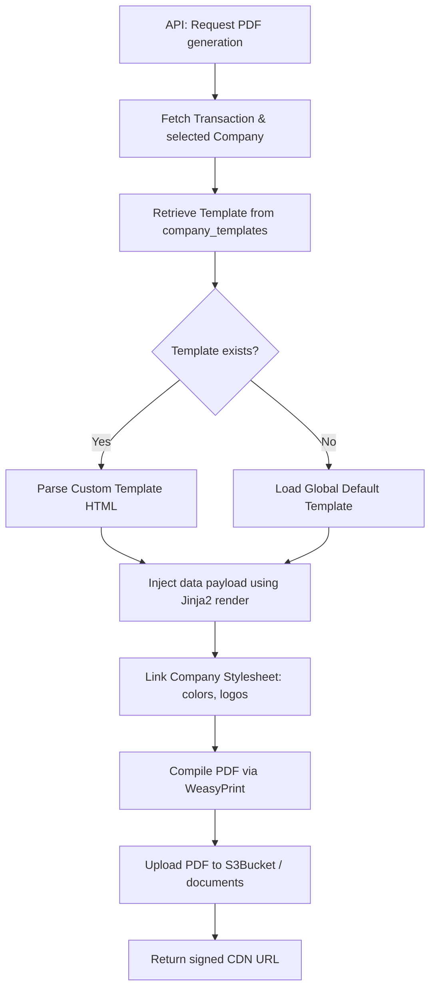

# Technical Architecture Document (TAD)
## Multi-Company, Cash Collection, & Template Engine Integration

**Document Version:** 1.0.0  
**Date:** 2026-06-26  
**Status:** Under Review  
**Target Tech Stack:** FastAPI, SQLAlchemy 2.0 (asyncio), PostgreSQL (with RLS), Celery, Redis, WeasyPrint, React 18, Ant Design 5, React Native (TS)

---

## 1. System Architecture & Logical Topology

This design introduces a two-tier scoping mechanism beneath the platform admin level:
1.  **Tenant Scope (`tenant_id`)**: Security isolation boundary. Enforced by PostgreSQL Row-Level Security (RLS) and app-layer checks.
2.  **Company Scope (`company_id`)**: Functional and reporting boundary. Managed by explicit filters and database constraints.

```
+-----------------------------------------------------------+
|                      PLATFORM DATABASE                    |
|                                                           |
|   +---------------------------------------------------+   |
|   |                  TENANT SCHEMA                     |   |
|   |   (Isolated by RLS: tenant_id = app.tenant_id)    |   |
|   |                                                   |   |
|   |   +------------------+     +------------------+   |   |
|   |   |    companies     |     |   users (RBAC)   |   |   |
|   |   +--------+---------+     +--------+---------+   |   |
|   |            |                        |             |   |
|   |            | 1                      | 1           |   |
|   |            |                        |             |   |
|   |            | *                      | *           |   |
|   |   +--------v---------+     +--------v---------+   |   |
|   |   |   transactions   |     | cash_collections |   |   |
|   |   | (Invoices, etc.) |     +------------------+   |   |
|   |   +------------------+                            |   |
|   +---------------------------------------------------+   |
+-----------------------------------------------------------+
```

---

## 2. Database Design & Schema Specifications

All tables inherit from `Base` and either `TimestampMixin` or `TenantMixin`.

### 2.1. SQLAlchemy Data Models

#### 2.1.1. `Company` Model (`app/models/company.py`)
```python
import uuid
from typing import Dict, Any
from sqlalchemy import UUID, String, Boolean, Text, JSON
from sqlalchemy.orm import Mapped, mapped_column, relationship
from app.core.database import Base
from app.models.base import TenantMixin

class Company(Base, TenantMixin):
    __tablename__ = "companies"

    name: Mapped[str] = mapped_column(String(255), nullable=False, index=True)
    gst_status: Mapped[str] = mapped_column(String(50), default="NON_GST", nullable=False)  # GST, NON_GST
    gstin: Mapped[str] = mapped_column(String(20), nullable=True)
    address: Mapped[str] = mapped_column(Text, nullable=True)
    
    # JSON containing phone, email, website keys
    contact_details: Mapped[Dict[str, Any]] = mapped_column(JSON, default=dict, nullable=False)
    
    # JSON containing bank_name, beneficiary_name, account_number, ifsc_code, branch keys
    bank_details: Mapped[Dict[str, Any]] = mapped_column(JSON, default=dict, nullable=False)
    logo_url: Mapped[str] = mapped_column(String(500), nullable=True)
    
    # JSON containing name, designation, signature_url keys
    authorized_signatory: Mapped[Dict[str, Any]] = mapped_column(JSON, default=dict, nullable=False)
    
    is_default: Mapped[bool] = mapped_column(Boolean, default=False, nullable=False)
    is_active: Mapped[bool] = mapped_column(Boolean, default=True, nullable=False)

    # Relationships
    templates: Mapped[list["CompanyTemplate"]] = relationship("CompanyTemplate", back_populates="company", cascade="all, delete-orphan")
```

#### 2.1.2. `CompanyTemplate` Model (`app/models/company_template.py`)
```python
import uuid
from sqlalchemy import UUID, String, Boolean, Text, ForeignKey
from sqlalchemy.orm import Mapped, mapped_column, relationship
from app.core.database import Base
from app.models.base import TenantMixin

class CompanyTemplate(Base, TenantMixin):
    __tablename__ = "company_templates"

    company_id: Mapped[uuid.UUID] = mapped_column(UUID(as_uuid=True), ForeignKey("companies.id", ondelete="CASCADE"), nullable=False)
    document_type: Mapped[str] = mapped_column(String(50), nullable=False, index=True)  # QUOTATION, TAX_INVOICE, etc.
    template_html: Mapped[str] = mapped_column(Text, nullable=False)
    header_html: Mapped[str] = mapped_column(Text, nullable=True)
    footer_html: Mapped[str] = mapped_column(Text, nullable=True)
    is_active: Mapped[bool] = mapped_column(Boolean, default=True, nullable=False)

    # Relationships
    company: Mapped["Company"] = relationship("Company", back_populates="templates")
```

#### 2.1.3. `CashCollection` Model (`app/models/cash_collection.py`)
```python
import uuid
from datetime import datetime
from sqlalchemy import UUID, String, Numeric, Text, DateTime, ForeignKey, func
from sqlalchemy.orm import Mapped, mapped_column, relationship
from app.core.database import Base
from app.models.base import TenantMixin

class CashCollection(Base, TenantMixin):
    __tablename__ = "cash_collections"

    employee_id: Mapped[uuid.UUID] = mapped_column(UUID(as_uuid=True), ForeignKey("users.id"), nullable=False, index=True)
    customer_name: Mapped[str] = mapped_column(String(255), nullable=False, index=True)
    company_id: Mapped[uuid.UUID] = mapped_column(UUID(as_uuid=True), ForeignKey("companies.id"), nullable=False)
    service_ticket_id: Mapped[uuid.UUID] = mapped_column(UUID(as_uuid=True), ForeignKey("service_tickets.id"), nullable=True)
    invoice_id: Mapped[uuid.UUID] = mapped_column(UUID(as_uuid=True), ForeignKey("invoices.id"), nullable=True)
    amount: Mapped[float] = mapped_column(Numeric(12, 2), nullable=False)
    collected_at: Mapped[datetime] = mapped_column(DateTime(timezone=True), nullable=False)
    payment_mode: Mapped[str] = mapped_column(String(50), default="CASH", nullable=False)
    remarks: Mapped[str] = mapped_column(Text, nullable=True)
    receipt_photo_url: Mapped[str] = mapped_column(String(500), nullable=True)
    status: Mapped[str] = mapped_column(String(50), default="pending", nullable=False, index=True)  # pending, received, rejected

    # Relationships
    employee: Mapped["User"] = relationship("User")
    company: Mapped["Company"] = relationship("Company")
    logs: Mapped[list["CashCollectionLog"]] = relationship("CashCollectionLog", back_populates="collection", cascade="all, delete-orphan")
```

#### 2.1.4. `CashCollectionLog` Model (`app/models/cash_collection_log.py`)
```python
import uuid
from datetime import datetime
from sqlalchemy import UUID, String, Text, DateTime, ForeignKey, func
from sqlalchemy.orm import Mapped, mapped_column, relationship
from app.core.database import Base
from app.models.base import TenantMixin

class CashCollectionLog(Base, TenantMixin):
    __tablename__ = "cash_collection_logs"

    cash_collection_id: Mapped[uuid.UUID] = mapped_column(UUID(as_uuid=True), ForeignKey("cash_collections.id", ondelete="CASCADE"), nullable=False, index=True)
    action: Mapped[str] = mapped_column(String(50), nullable=False)  # APPROVED, REJECTED
    action_by: Mapped[uuid.UUID] = mapped_column(UUID(as_uuid=True), ForeignKey("users.id"), nullable=False)
    action_at: Mapped[datetime] = mapped_column(DateTime(timezone=True), server_default=func.now(), nullable=False)
    notes: Mapped[str] = mapped_column(Text, nullable=True)

    # Relationships
    collection: Mapped["CashCollection"] = relationship("CashCollection", back_populates="logs")
    actor: Mapped["User"] = relationship("User")
```

---

## 3. Database Migration Blueprint (Alembic)

The migration script must register foreign key constraints and retroactively assign a `company_id` to existing transactional records.

```python
"""add multi company and cash collection tables

Revision ID: 2c19a9f24300
Revises: 1a88a8f13400
Create Date: 2026-06-26 21:10:00.000000
"""
from alembic import op
import sqlalchemy as sa

def upgrade():
    # 1. Create Companies table
    op.create_table(
        'companies',
        sa.Column('id', sa.UUID(), nullable=False),
        sa.Column('tenant_id', sa.UUID(), nullable=False),
        sa.Column('name', sa.String(length=255), nullable=False),
        sa.Column('gst_status', sa.String(length=50), server_default='NON_GST', nullable=False),
        sa.Column('gstin', sa.String(length=20), nullable=True),
        sa.Column('address', sa.Text(), nullable=True),
        sa.Column('contact_details', sa.JSON(), nullable=False, server_default='{}'),
        sa.Column('bank_details', sa.JSON(), nullable=False, server_default='{}'),
        sa.Column('logo_url', sa.String(length=500), nullable=True),
        sa.Column('authorized_signatory', sa.JSON(), nullable=False, server_default='{}'),
        sa.Column('is_default', sa.Boolean(), server_default='false', nullable=False),
        sa.Column('is_active', sa.Boolean(), server_default='true', nullable=False),
        sa.Column('created_at', sa.DateTime(timezone=True), server_default=sa.text('now()'), nullable=False),
        sa.Column('updated_at', sa.DateTime(timezone=True), server_default=sa.text('now()'), nullable=False),
        sa.PrimaryKeyConstraint('id')
    )
    op.create_index('ix_companies_tenant_id', 'companies', ['tenant_id'])

    # 2. Create Company Templates table
    op.create_table(
        'company_templates',
        sa.Column('id', sa.UUID(), nullable=False),
        sa.Column('tenant_id', sa.UUID(), nullable=False),
        sa.Column('company_id', sa.UUID(), nullable=False),
        sa.Column('document_type', sa.String(length=50), nullable=False),
        sa.Column('template_html', sa.Text(), nullable=False),
        sa.Column('header_html', sa.Text(), nullable=True),
        sa.Column('footer_html', sa.Text(), nullable=True),
        sa.Column('is_active', sa.Boolean(), server_default='true', nullable=False),
        sa.Column('created_at', sa.DateTime(timezone=True), server_default=sa.text('now()'), nullable=False),
        sa.Column('updated_at', sa.DateTime(timezone=True), server_default=sa.text('now()'), nullable=False),
        sa.PrimaryKeyConstraint('id'),
        sa.ForeignKeyConstraint(['company_id'], ['companies.id'], ondelete='CASCADE')
    )

    # 3. Create Cash Collections table
    op.create_table(
        'cash_collections',
        sa.Column('id', sa.UUID(), nullable=False),
        sa.Column('tenant_id', sa.UUID(), nullable=False),
        sa.Column('employee_id', sa.UUID(), nullable=False),
        sa.Column('customer_name', sa.String(length=255), nullable=False),
        sa.Column('company_id', sa.UUID(), nullable=False),
        sa.Column('service_ticket_id', sa.UUID(), nullable=True),
        sa.Column('invoice_id', sa.UUID(), nullable=True),
        sa.Column('amount', sa.Numeric(precision=12, scale=2), nullable=False),
        sa.Column('collected_at', sa.DateTime(timezone=True), nullable=False),
        sa.Column('payment_mode', sa.String(length=50), server_default='CASH', nullable=False),
        sa.Column('remarks', sa.Text(), nullable=True),
        sa.Column('receipt_photo_url', sa.String(length=500), nullable=True),
        sa.Column('status', sa.String(length=50), server_default='pending', nullable=False),
        sa.Column('created_at', sa.DateTime(timezone=True), server_default=sa.text('now()'), nullable=False),
        sa.Column('updated_at', sa.DateTime(timezone=True), server_default=sa.text('now()'), nullable=False),
        sa.PrimaryKeyConstraint('id'),
        sa.ForeignKeyConstraint(['company_id'], ['companies.id']),
        sa.ForeignKeyConstraint(['employee_id'], ['users.id']),
        sa.ForeignKeyConstraint(['invoice_id'], ['invoices.id']),
        sa.ForeignKeyConstraint(['service_ticket_id'], ['service_tickets.id'])
    )

    # 4. Create Cash Collection Logs table
    op.create_table(
        'cash_collection_logs',
        sa.Column('id', sa.UUID(), nullable=False),
        sa.Column('tenant_id', sa.UUID(), nullable=False),
        sa.Column('cash_collection_id', sa.UUID(), nullable=False),
        sa.Column('action', sa.String(length=50), nullable=False),
        sa.Column('action_by', sa.UUID(), nullable=False),
        sa.Column('action_at', sa.DateTime(timezone=True), server_default=sa.text('now()'), nullable=False),
        sa.Column('notes', sa.Text(), nullable=True),
        sa.PrimaryKeyConstraint('id'),
        sa.ForeignKeyConstraint(['cash_collection_id'], ['cash_collections.id'], ondelete='CASCADE'),
        sa.ForeignKeyConstraint(['action_by'], ['users.id'])
    )

    # 5. Populate Default Company rows for existing tenants to prevent nullable failures
    # (Insert script seeds a company using tenant settings, then marks it default)
    op.execute(
        """
        INSERT INTO companies (id, tenant_id, name, gst_status, gstdin, address, bank_details, is_default, is_active, created_at, updated_at)
        SELECT gen_random_uuid(), id, name, COALESCE(gstin, 'NON_GST'), gstin, registered_address, '{}'::json, true, true, now(), now()
        FROM tenants;
        """
    )

    # 6. Add company_id reference columns to existing transactional tables
    transactional_tables = ['leads', 'quotations', 'invoices', 'amc_contracts', 'service_tickets']
    for table in transactional_tables:
        op.add_column(table, sa.Column('company_id', sa.UUID(), nullable=True))
        
        # Link existing records to the newly created Default Company for their respective tenant
        op.execute(
            f"""
            UPDATE {table} t
            SET company_id = c.id
            FROM companies c
            WHERE t.tenant_id = c.tenant_id AND c.is_default = true;
            """
        )
        
        # Enforce foreign key and non-nullable constraint
        op.alter_column(table, 'company_id', nullable=False)
        op.create_foreign_key(f'fk_{table}_company_id', table, 'companies', ['company_id'], ['id'])
```

---

## 4. Backend Service Architecture (FastAPI)

### 4.1. Tenant-Company Dependency Layer (`app/api/deps.py`)

A validation dependency asserts company scoping at the API entry point.

```python
from uuid import UUID
from fastapi import Depends, HTTPException, status
from app.api.deps import get_current_tenant_id  # Existing tenant resolution
from app.repositories.company import CompanyRepository

async def get_validated_company_id(
    company_id: UUID,
    tenant_id: UUID = Depends(get_current_tenant_id),
    company_repo: CompanyRepository = Depends()
) -> UUID:
    """Dependency verifying that the company exists, is active, and is owned by the tenant."""
    company = await company_repo.get(company_id)
    if not company:
        raise HTTPException(
            status_code=status.HTTP_404_NOT_FOUND,
            detail="Specified operating company does not exist."
        )
    if not company.is_active:
        raise HTTPException(
            status_code=status.HTTP_400_BAD_REQUEST,
            detail="The selected company is deactivated."
        )
    return company_id
```

### 4.2. Repository Extension (`app/repositories/base.py`)

No database transaction must proceed without injecting the Active Tenant Context into the Postgres session variable (`app.tenant_id`). The new tables rely on this execution lifecycle:

```python
async def _set_rls_context(self):
    conn = await self.session.connection()
    if conn.dialect.name == "postgresql":
        # RLS relies on local variable app.tenant_id within the transaction.
        await self.session.execute(
            text("SELECT set_config('app.tenant_id', :tid, true)"),
            {"tid": str(self.tenant_id)},
        )
```

### 4.3. Dynamic Document PDF Generation Pipeline

The generation pipeline uses dynamic layouts per company based on the selected `company_id`.



#### Jinja2 PDF Compilation Logic Example:
```python
from jinja2 import Environment, FileSystemLoader
from weasyprint import HTML, CSS
from app.core.config import settings

class DocumentGenerationService:
    def __init__(self, db_session):
        self.db = db_session

    async def generate_document_pdf(self, transaction_obj, document_type: str) -> str:
        # Load Company Details
        company = transaction_obj.company
        
        # Load Template Code from Database
        template_record = await self.get_template(company.id, document_type)
        template_html = template_record.template_html if template_record else self.load_default_html(document_type)

        # Environment Context Mapping
        env = Environment(loader=FileSystemLoader("app/templates/defaults"))
        template = env.from_string(template_html)
        
        context = {
            "company": {
                "name": company.name,
                "gstin": company.gstin,
                "address": company.address,
                "bank": company.bank_details,
                "logo": company.logo_url,
                "signatory": company.authorized_signatory
            },
            "doc": transaction_obj,
            "items": getattr(transaction_obj, "line_items", [])
        }
        
        rendered_html = template.render(context)
        
        # Compile via WeasyPrint
        pdf_bytes = HTML(string=rendered_html).write_pdf(
            stylesheets=[CSS(string="@page { size: A4; margin: 15mm; }")]
        )
        
        # Upload object to storage bucket
        storage_path = f"tenants/{transaction_obj.tenant_id}/companies/{company.id}/{document_type.lower()}/{transaction_obj.id}.pdf"
        s3_url = await upload_to_s3(storage_path, pdf_bytes, content_type="application/pdf")
        return s3_url
```

---

## 5. Web Frontend Implementation Blueprint (React & Ant Design)

### 5.1. Global Tenant State Management (Redux Slice)

A centralized hook manages the fetched active company data to avoid redundant API calls.

```typescript
import { createSlice, createAsyncThunk } from '@reduxjs/toolkit';
import axios from 'axios';

export const fetchActiveCompanies = createAsyncThunk(
  'companies/fetchActive',
  async (_, { rejectWithValue }) => {
    try {
      const response = await axios.get('/api/v1/companies?is_active=true');
      return response.data;
    } catch (err: any) {
      return rejectWithValue(err.response.data);
    }
  }
);

interface CompanyState {
  list: any[];
  defaultCompany: any | null;
  loading: boolean;
}

const companySlice = createSlice({
  name: 'companies',
  initialState: { list: [], defaultCompany: null, loading: false } as CompanyState,
  reducers: {},
  extraReducers: (builder) => {
    builder
      .addCase(fetchActiveCompanies.pending, (state) => { state.loading = true; })
      .addCase(fetchActiveCompanies.fulfilled, (state, action) => {
        state.loading = false;
        state.list = action.payload;
        state.defaultCompany = action.payload.find((c: any) => c.is_default) || null;
      });
  }
});
```

### 5.2. Ant Design 5 Selection Context Hook

```tsx
import React, { useEffect } from 'react';
import { Form, Select } from 'antd';
import { useAppDispatch, useAppSelector } from '../hooks/redux';
import { fetchActiveCompanies } from '../store/slices/companySlice';

export const FormCompanySelector: React.FC<{ isNew: boolean }> = ({ isNew }) => {
  const dispatch = useAppDispatch();
  const form = Form.useFormInstance();
  const { list: companies, defaultCompany, loading } = useAppSelector((state) => state.companies);

  useEffect(() => {
    if (companies.length === 0) {
      dispatch(fetchActiveCompanies());
    }
  }, [dispatch, companies.length]);

  useEffect(() => {
    if (isNew && defaultCompany && form) {
      form.setFieldValue('company_id', defaultCompany.id);
    }
  }, [isNew, defaultCompany, form]);

  return (
    <Form.Item
      name="company_id"
      label="Operating Entity"
      rules={[{ required: true, message: 'Please select a company' }]}
    >
      <Select
        loading={loading}
        disabled={!isNew}
        placeholder="Select operating company..."
        options={companies.map(c => ({
          label: `${c.name} ${c.is_default ? '(Default)' : ''}`,
          value: c.id
        }))}
      />
    </Form.Item>
  );
};
```

---

## 6. Mobile Offline Sync Architecture (React Native)

Field engineers must log cash receipts in real-time, even during local cellular dropouts.

```
[Mobile app UI]
      │
      ▼
[Validate locally] ──(Network Offline)──> [Save to Local SQLite]
      │                                         │
 (Network Online)                          (Network Restored)
      │                                         │
      ▼                                         ▼
[POST API endpoint] <───────────────────────────┘
      │
      ▼
[S3 File Upload] ──> [Save to Postgres DB]
```

### 6.1. SQLite Offline Cache Schema
The local database schema mimics the target remote API payload.

```sql
CREATE TABLE IF NOT EXISTS offline_cash_collections (
    id TEXT PRIMARY KEY,
    customer_name TEXT NOT NULL,
    company_id TEXT NOT NULL,
    service_ticket_id TEXT,
    invoice_id TEXT,
    amount REAL NOT NULL,
    collected_at TEXT NOT NULL,
    remarks TEXT,
    local_photo_path TEXT,
    sync_status TEXT DEFAULT 'pending'
);
```

### 6.2. Offline Sync Manager Hook (`mobile/src/hooks/useSyncManager.ts`)
Uses `react-native-netinfo` to listen for connectivity changes and trigger queued synchronizations.

```typescript
import NetInfo from '@react-native-community/netinfo';
import { useEffect } from 'react';
import { syncOfflineCashEntries } from '../services/syncService';

export const useSyncManager = () => {
  useEffect(() => {
    const unsubscribe = NetInfo.addEventListener(state => {
      if (state.isConnected && state.isInternetReachable) {
        // Trigger background sync task
        syncOfflineCashEntries().catch(console.error);
      }
    });

    return () => unsubscribe();
  }, []);
};
```

### 6.3. Synchronization Pipeline (`mobile/src/services/syncService.ts`)
For items with a `local_photo_path`:
1.  **Request upload token**: Fetch presigned upload URL from `/api/v1/assets/presigned-url`.
2.  **Upload File**: Direct PUT to S3 using the binary stream file.
3.  **Post Payload**: Submit complete entity schema with the public `receipt_photo_url` returned from S3.
4.  **Purge Local Row**: Mark SQLite entry as synced or purge.

---

## 7. API Security & Role-Based Permissions (RBAC)

The new modules map directly to default system roles:

| API Route | Allowed Roles | Audit Log | Action Description |
|---|---|---|---|
| `POST /api/v1/companies` | `admin` | Yes | Define new operating company |
| `PUT /api/v1/companies/*` | `admin` | Yes | Modify company config |
| `POST /api/v1/templates` | `admin` | Yes | Set custom printing template |
| `POST /api/v1/cash-collections` | `technician`, `coordinator`, `manager`, `admin` | Yes | Log cash receipt in the field |
| `POST /api/v1/cash-collections/*/action` | `admin`, `accounts`, `manager` | Yes | Review, approve or reject collection |
| `GET /api/v1/cash-collections/pending` | `admin`, `accounts`, `manager` | No | Fetch pending verifications list |

---

## 8. Verification & QA Matrix

### 8.1. Automation Test Case Definitions

*   `test_default_company_assignment_exclusivity`:
    *   **Goal**: Ensure setting a company as default resets the default status of all other companies.
    *   **Logic**: Query `companies` table, verify only one row contains `is_default = true`. Put request on second company `is_default = true`, re-query database and assert the first company's `is_default` evaluates to `false`.
*   `test_transaction_company_isolation`:
    *   **Goal**: Ensure transaction generation blocks invalid company assignment.
    *   **Logic**: Try to submit a Quotation payload with a `company_id` belonging to Tenant B using a Tenant A user authorization token. Assert response returns HTTP Status `403 Forbidden` or `404 Not Found`.
*   `test_postgres_rls_policies`:
    *   **Goal**: Verify database-level tenant isolation.
    *   **Logic**: Initiate an asynchronous SQLAlchemy session. Run raw select on `companies` table without running `_set_rls_context()`. Verify that zero rows are returned in PostgreSQL production mode.
